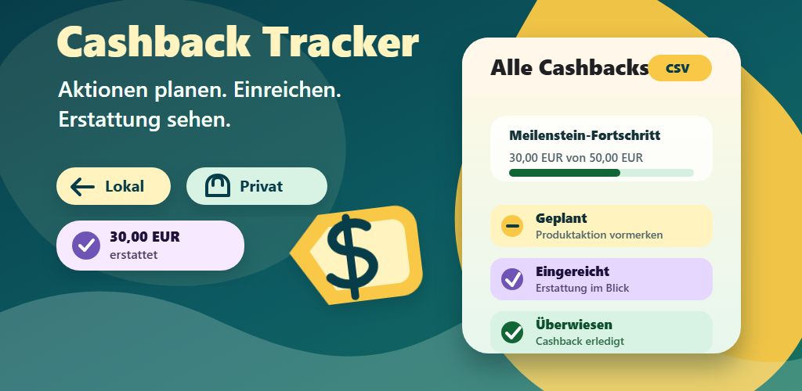
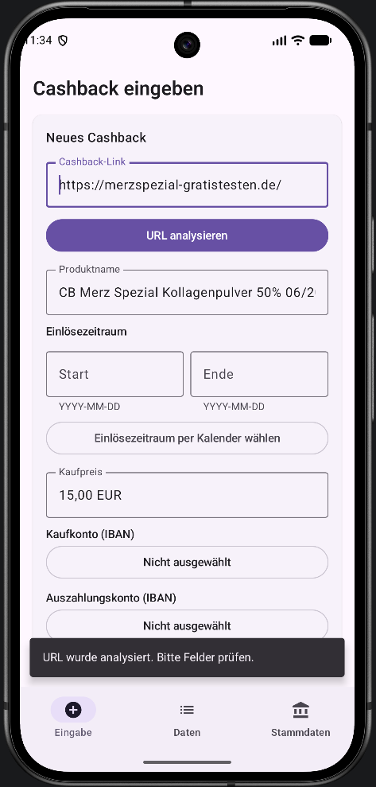
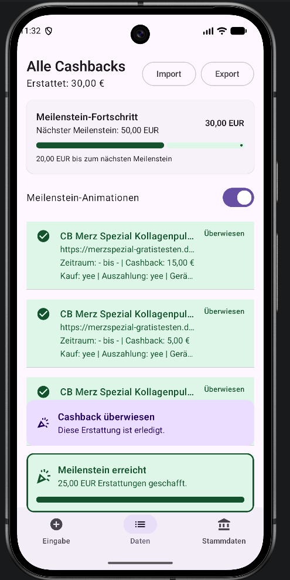

# Cashback Tracker

<table>
  <tr>
    <td align="center">
       
      <b>Input View</b>
    </td>
    <td align="center">
       
      <b>Data View</b>
    </td>
  </tr>
</table>

Cashback Tracker is an Android app for tracking cashback and "try for free"
promotions locally on your device.

It helps you keep track of which promotions are still planned, which ones have
already been submitted, and which reimbursements have been paid out.

## Features

- Save cashback promotions with link, product name, `Einlösezeitraum`, purchase
  price, purchase account, payout account, device, and notes.
- Mark promotions as `Geplant`, `Eingereicht`, or `Überwiesen`.
- Change a promotion's status by tapping its card in the `Daten` list.
- Analyze cashback links on demand and prefill product name and date range when
  the page contains usable information.
- Highlight accounts and devices that were already used for the same promotion.
- Reuse previous entries faster through suggestions based on saved promotions.
- Manage bank accounts and devices locally in `Stammdaten`.
- Export and import cashback data as CSV.
- Optional celebration animations for new entries, paid cashbacks, and
  reimbursement milestones, with progress toward the next milestone and short
  reward sounds for paid cashbacks and milestones.

## Installation

When the Play Console listing is live, install Cashback Tracker from Google
Play. Until then, or for direct APK distribution, download the APK from the
latest GitHub Release:

[GitHub Releases](https://github.com/kequach/cashbacktracker/releases)

Open the APK on your Android device and confirm the installation. Depending on
your Android version, you may need to allow installing apps from this source.

For updates, install the newer APK over the existing app. Do not uninstall the
app if you want to keep your local data.

## First Steps

1. Open the `Stammdaten` tab.
2. Add your bank accounts. Use nicknames so you can recognize them quickly.
3. Add the devices you use to redeem cashback promotions.
4. Open the `Eingabe` tab.
5. Paste the cashback link and optionally tap `URL analysieren`.
6. Fill in product name, date range, purchase price, `Kaufkonto`,
   `Auszahlungskonto`, `Gerät`, and notes.
7. Save the promotion as `Geplant` or `Eingereicht`.
8. Open the `Daten` tab to see all promotions and advance their status by
   tapping them.

## Status

- `Geplant`: You still want to buy or submit the promotion.
- `Eingereicht`: You submitted the promotion and are waiting for the payout.
- `Überwiesen`: The cashback has been paid out.

If you tap by mistake, keep tapping the promotion. The status cycles through
`Geplant`, `Eingereicht`, and `Überwiesen`.

## Data And Privacy

- All app data stays local on your device.
- There is no cloud sync, advertising, or analytics.
- IBANs, account holder names, device notes, and cashback notes are stored
  encrypted.
- URL analysis only accesses a website when you actively tap `URL analysieren`.
- CSV export is intentionally unencrypted. The exported file contains readable
  cashback data, IBANs, and notes.
- CSV import reads the same unencrypted backup format and can restore cashback
  entries, bank accounts, and devices from that file.
- Privacy policy: [PRIVACY.md](PRIVACY.md)

## CSV Backup And Restore

In the `Daten` tab, you can export your entries as CSV. Use this if you want to
view your data in a spreadsheet or create a manual backup.

You can also import a CSV backup from the same tab. Import creates cashback
entries and restores missing bank accounts or devices when the CSV contains
enough data for them.

Treat CSV files like sensitive documents because they can contain readable bank
details and notes.

## Current Limits

- The app is built for 100 percent cashback promotions. The purchase price is
  therefore also the expected reimbursement amount.
- URL analysis is a best-effort helper. Some websites do not expose data in a
  way that can be parsed reliably.
- There is no cloud sync.
- There is no password manager, autofill, or browser integration.

## More Information

- Version history: [CHANGELOG.md](CHANGELOG.md)
- Privacy policy: [PRIVACY.md](PRIVACY.md)
- Technical development, build, release, and CI details:
  [DEVELOPMENT.md](DEVELOPMENT.md)
